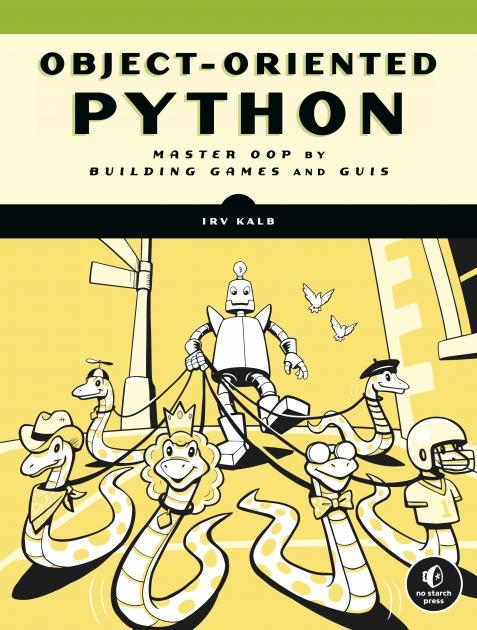

# Object-Oriented-Python-by-Irv-Kalb
I am reading the book https://nostarch.com/object-oriented-python. I have created this repo to store the code created by following this book.



## To install pygame

```bash
pip install -r requirements.txt
```

or

```bash
python3 -m pip install -U pip --user
python3 -m pip install -U pygame --user
```

In order to ensure pygame was correctly installed run this command. We should see a simple game starting.

```bash
python -m pygame.examples.aliens
```

Expected output:

```bash
python -m pygame.examples.aliens
pygame 2.6.1 (SDL 2.28.4, Python 3.10.5)
Hello from the pygame community. https://www.pygame.org/contribute.html
```